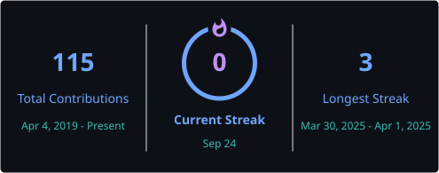

  
# 👋 **Hi, I'm Simin Alibani.**
### AI & Signal Processing Engineer | Researcher (Signal & Image Processing • ML • DL • RL)

---

I’m Simin Alibani, a researcher and engineer specializing in signal and image processing, with an M.Sc. in Electrical Engineering (Communication Systems) from Shiraz University. My expertise spans signal processing, compressed sensing, matrix completion, array signal processing, optimization, and computational methods for extracting meaningful information from complex data. I am particularly interested in developing effective algorithms, models, and computational solutions across diverse data modalities, with an emphasis on achieving high accuracy and low error rates.

I have over six years of experience in the space industry, where I have worked as a telecommunications researcher and engineer on the design and simulation of signal and image processing algorithms, noise modeling in operational environments, and the calibration, testing, and accuracy evaluation of digital sensors across software, laboratory, and field-testing environments. I have extensively used MATLAB, Python, C/C++, and R for simulation, software development, implementation, testing, and data visualization.

Alongside my engineering work, I have pursued hands-on projects in embedded systems involving ARM-based systems, Arduino, microcontrollers, and LabVIEW. This experience has also enabled me to bridge the gap between signal processing and simulation teams and hardware implementation teams, providing me with valuable insight into both computational and hardware-oriented development.

Over the past three years, my focus has increasingly shifted toward artificial intelligence, particularly deep learning, reinforcement learning, natural language processing, large language models (LLMs), vision-language models (VLMs), and multimodal learning. I am currently collaborating on research involving neural signals, including spikes and EEG, from both macaques and humans. Exploring the relationship between natural and artificial intelligence has become a major source of curiosity and motivation in my research.

🔭 I’m currently working on EEG and neural signal analysis, multimodal learning, and computational approaches to understanding natural intelligence.

🌱 I’m currently exploring deep learning, reinforcement learning, LLMs, VLMs, and multimodal AI.

👯 I’m looking to collaborate on research and R&D projects in machine learning, signal processing, neural data analysis, and intelligent systems.

🧠 I’m particularly interested in the intersection of artificial intelligence, signal processing, and computational neuroscience.

🛠️ Ask me about signal processing, machine learning, deep learning, computational intelligence, MATLAB, Python, and scientific data analysis.

💼 Connect with me on [LinkedIn](https://www.linkedin.com/in/simin-alibani).

🌐 Explore my research, projects, and professional experience on my [personal website](https://sites.google.com/view/siminalibani/home?authuser=1).

📚 Find my academic work and publications on [Google Scholar](https://scholar.google.com/citations?user=7LPCWTYAAAAJ&hl=en).

📫 You can reach me at: [EMAIL](alibani.simin@gmail.com).

🧗 **Support my adventures — one carabiner at a time.** 😄

---

### 📂 Current Projects

---

### 🛠️ Languages & Tools

  
  &nbsp;&nbsp;
  
  &nbsp;&nbsp;
  
  &nbsp;&nbsp;
  
  &nbsp;&nbsp;
  
  &nbsp;&nbsp;
  
  &nbsp;&nbsp;
  
  &nbsp;&nbsp;
  
  &nbsp;&nbsp;
  
  &nbsp;&nbsp;
  
  &nbsp;&nbsp;
  
  &nbsp;&nbsp;
  
  &nbsp;&nbsp;
  
  &nbsp;&nbsp;
  
  &nbsp;&nbsp;
  
  &nbsp;&nbsp;
  
  &nbsp;&nbsp;
  
  &nbsp;&nbsp;
  

---

<h2 align="center">📊 GitHub Analytics</h2>
<table align="center">
  <tr>
    <td align="center">
      
    </td>
    <td align="center">
      
    </td>
  </tr>
</table>

 

  

